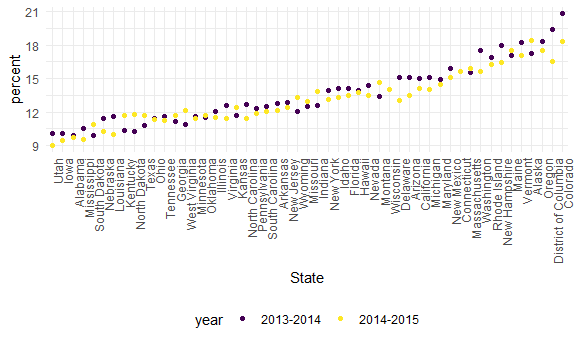
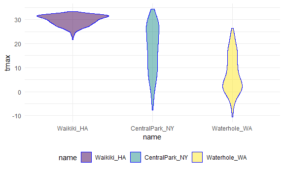

data wrangling ii
================
Leighanne Wang
10/18/2020

# Data from the Web

## Scrape Table

Table from [this
page](http://samhda.s3-us-gov-west-1.amazonaws.com/s3fs-public/field-uploads/2k15StateFiles/NSDUHsaeShortTermCHG2015.htm)

Read in html

``` r
url = "http://samhda.s3-us-gov-west-1.amazonaws.com/s3fs-public/field-uploads/2k15StateFiles/NSDUHsaeShortTermCHG2015.htm"

drug_use_html = read_html(url)
```

extract tables

``` r
tabl_marj =
  drug_use_html %>% 
  html_nodes(css = "table") %>% 
  first() %>% 
  html_table() %>% 
  slice(-1) %>% 
  as_tibble()
```

## Star Wars Movie Info

I want the data from [here](https://www.imdb.com/list/ls070150896/).

``` r
url = "https://www.imdb.com/list/ls070150896/"
swm_html = read_html(url)
```

Grab elements that I want

``` r
title_vec = 
  swm_html %>% 
  html_nodes(css = ".lister-item-header a") %>% 
  html_text()

gross_rev_vec = 
  swm_html %>% 
  html_nodes(css = ".text-small:nth-child(7) span:nth-child(5)") %>% 
  html_text()

runtime_vec = 
  swm_html %>% 
  html_nodes(css = ".runtime") %>% 
  html_text()

swm_df = 
  tibble(
    title = title_vec,
    gross_rev = gross_rev_vec,
    runtime = runtime_vec)
```

## NYC Water Data

Coming from API:

``` r
#csv file
nyc_water = 
  GET("https://data.cityofnewyork.us/resource/ia2d-e54m.csv") %>% 
  content("parsed")
```

    ## Parsed with column specification:
    ## cols(
    ##   year = col_double(),
    ##   new_york_city_population = col_double(),
    ##   nyc_consumption_million_gallons_per_day = col_double(),
    ##   per_capita_gallons_per_person_per_day = col_double()
    ## )

``` r
#json file
nyc_water = 
  GET("https://data.cityofnewyork.us/resource/ia2d-e54m.json") %>% 
  content("text") %>% 
  jsonlite::fromJSON() %>% 
  as_tibble()
```

## BRFSS

Same process, different data

``` r
brfss_2010 = 
  GET("https://chronicdata.cdc.gov/resource/acme-vg9e.csv",
      query = list("$limit" = 5000)) %>% 
  content("parsed")
```

    ## Parsed with column specification:
    ## cols(
    ##   .default = col_character(),
    ##   year = col_double(),
    ##   sample_size = col_double(),
    ##   data_value = col_double(),
    ##   confidence_limit_low = col_double(),
    ##   confidence_limit_high = col_double(),
    ##   display_order = col_double(),
    ##   locationid = col_logical()
    ## )

    ## See spec(...) for full column specifications.

## Some data aren’t so nice

Let’s look at Pokemon \!\!

``` r
pokemon_data = 
  GET("https://pokeapi.co/api/v2/pokemon/1") %>% 
  content
pokemon_data$name
```

    ## [1] "bulbasaur"

``` r
pokemon_data$height
```

    ## [1] 7

``` r
pokemon_data$abilities
```

    ## [[1]]
    ## [[1]]$ability
    ## [[1]]$ability$name
    ## [1] "overgrow"
    ## 
    ## [[1]]$ability$url
    ## [1] "https://pokeapi.co/api/v2/ability/65/"
    ## 
    ## 
    ## [[1]]$is_hidden
    ## [1] FALSE
    ## 
    ## [[1]]$slot
    ## [1] 1
    ## 
    ## 
    ## [[2]]
    ## [[2]]$ability
    ## [[2]]$ability$name
    ## [1] "chlorophyll"
    ## 
    ## [[2]]$ability$url
    ## [1] "https://pokeapi.co/api/v2/ability/34/"
    ## 
    ## 
    ## [[2]]$is_hidden
    ## [1] TRUE
    ## 
    ## [[2]]$slot
    ## [1] 3

# Strings and Factors

``` r
string_vec = c("my", "name", "is", "jeff")
str_detect(string_vec, "jeff") # detects where Jeff is
```

    ## [1] FALSE FALSE FALSE  TRUE

``` r
str_detect(string_vec, "e") # detects where 'e' is
```

    ## [1] FALSE  TRUE FALSE  TRUE

``` r
str_replace(string_vec, "jeff", "Jeff") #replace one string with another
```

    ## [1] "my"   "name" "is"   "Jeff"

``` r
string_vec = c(
  "i think we all rule for participating",
  "i think i have been caught",
  "i think this will be quite fun actually",
  "it will be fun, i think"
)
str_detect(string_vec, "^i think") #detects only things that begin with "i think"
```

    ## [1]  TRUE  TRUE  TRUE FALSE

``` r
str_detect(string_vec, "i think$") #detects only things that end with "i think"
```

    ## [1] FALSE FALSE FALSE  TRUE

``` r
string_vec = c(
  "Y'all remember Pres. HW Bush?",
  "I saw a green bush",
  "BBQ and Bushwalking at Molonglo Gorge",
  "BUSH -- LIVE IN CONCERT!!"
  )

str_detect(string_vec,"[Bb]ush") # will find and match either B or b characters and the rest
```

    ## [1]  TRUE  TRUE  TRUE FALSE

``` r
string_vec = c(
  'Its 7:11 in the evening',
  'want to go to 7-11?',
  'my flight is AA711',
  'NetBios: scanning ip 203.167.114.66'
  )

str_detect(string_vec, "7.11") # will find anything for the with the '.', to find only the '7.11' then do "7\\.11"
```

    ## [1]  TRUE  TRUE FALSE  TRUE

``` r
string_vec = c(
  'The CI is [2, 5]',
  ':-]',
  ':-[',
  'I found the answer on pages [6-7]'
  )

str_detect(string_vec, "\\[")
```

    ## [1]  TRUE FALSE  TRUE  TRUE

``` r
vec_sex = factor(c("male", "male", "female", "female"))
vec_sex
```

    ## [1] male   male   female female
    ## Levels: female male

``` r
#relevel factor
vec_sex = fct_relevel(vec_sex, "male")
vec_sex
```

    ## [1] male   male   female female
    ## Levels: male female

``` r
as.numeric(vec_sex)
```

    ## [1] 1 1 2 2

## NSDUH dataset

``` r
nsduh_url = "http://samhda.s3-us-gov-west-1.amazonaws.com/s3fs-public/field-uploads/2k15StateFiles/NSDUHsaeShortTermCHG2015.htm"

table_marj = 
  read_html(nsduh_url) %>% 
  html_nodes(css = "table") %>% 
  first() %>%
  html_table() %>%
  slice(-1) %>%
  as_tibble()
```

``` r
data_marj = 
  table_marj %>% 
  select(-contains("P Value")) %>% 
  pivot_longer(
    -State, 
    names_to = "age_year",
    values_to = "percent"
  ) %>% 
  separate(age_year, into = c("age", "year"), sep = "\\(") %>% 
  mutate(
    year = str_replace(year, "\\)", ""),
    percent = str_replace(percent, "[a-c]$", ""), 
    percent = as.numeric(percent)
  ) %>% 
  filter(!(State %in% c("Total U.S.", "Northeast", "Midwest", "South", "West"))
  )
```

With factors

``` r
data_marj %>%
  filter(age == "12-17") %>% 
  mutate(State = fct_reorder(State, percent)) %>% 
  ggplot(aes(x = State, y = percent, color = year)) + 
    geom_point() + 
    theme(axis.text.x = element_text(angle = 90, hjust = 1))
```



## Weather data

``` r
weather_df = 
  rnoaa::meteo_pull_monitors(
    c("USW00094728", "USC00519397", "USS0023B17S"),
    var = c("PRCP", "TMIN", "TMAX"), 
    date_min = "2017-01-01",
    date_max = "2017-12-31") %>%
  mutate(
    name = recode(
      id, 
      USW00094728 = "CentralPark_NY", 
      USC00519397 = "Waikiki_HA",
      USS0023B17S = "Waterhole_WA"),
    tmin = tmin / 10,
    tmax = tmax / 10) %>%
  select(name, id, everything())
```

    ## Registered S3 method overwritten by 'hoardr':
    ##   method           from
    ##   print.cache_info httr

    ## using cached file: C:\Users\leigh\AppData\Local\Cache/R/noaa_ghcnd/USW00094728.dly

    ## date created (size, mb): 2020-10-06 12:21:43 (7.537)

    ## file min/max dates: 1869-01-01 / 2020-10-31

    ## using cached file: C:\Users\leigh\AppData\Local\Cache/R/noaa_ghcnd/USC00519397.dly

    ## date created (size, mb): 2020-10-06 12:22:04 (1.703)

    ## file min/max dates: 1965-01-01 / 2020-03-31

    ## using cached file: C:\Users\leigh\AppData\Local\Cache/R/noaa_ghcnd/USS0023B17S.dly

    ## date created (size, mb): 2020-10-06 12:22:16 (0.882)

    ## file min/max dates: 1999-09-01 / 2020-10-31

``` r
weather_df %>%
  mutate(name = forcats::fct_relevel(name, c("Waikiki_HA", "CentralPark_NY", "Waterhole_WA"))) %>% 
  ggplot(aes(x = name, y = tmax)) + 
  geom_violin(aes(fill = name), color = "blue", alpha = .5) + 
  theme(legend.position = "bottom")
```

    ## Warning: Removed 3 rows containing non-finite values (stat_ydensity).


